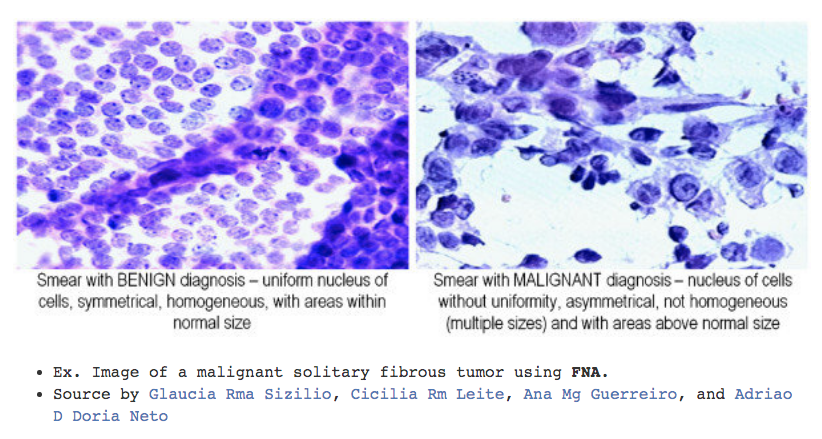

# Breast cancer prediction

## Introduction

In this project I will look at a dataset of patient data relating to breast cancer, which is available on Kaggle as the [Wisconsin Breast Cancer dataset](https://www.kaggle.com/uciml/breast-cancer-wisconsin-data). 

The dataset features are computed from a digitized image of a fine needle aspirate (FNA) of a breast mass. They describe characteristics of the cell nuclei present in the image in the 3-dimensional space is that described in: K. P. Bennett and O. L. Mangasarian: "Robust Linear Programming Discrimination of Two Linearly Inseparable Sets", Optimization Methods and Software 1, 1992, 23-34.

The dataset was released in November 1995 and the original source can be found [here](https://archive.ics.uci.edu/ml/datasets/Breast+Cancer+Wisconsin+%28Diagnostic%29). 

An example of images of cells that this data comes from of both malignant and benign tumors can be seen below.

I will develop a machine learning model that will aim to predict Malignant tumors with the highest accuracy.

## Results

1. In the __[first project](https://github.com/pranath/breast_cancer_prediction/blob/master/breast_cancer_prediction.ipynb)__ finished in April 2019, the best result was an overall F1 score on all categories of 0.99
2. In the __[latest project](https://github.com/pranath/breast_cancer_prediction/blob/master/breast_cancer_prediction2.ipynb)__ finished in December 2019, the best result was an overall F1 score on all categories of 0.96. Despite this being a lower score than the first project, this is considered to be a more relaiable estimate of model performance due to the use of more advanced validation techniques. New techniques used in this latest project include: More statisitcal methods, UMAP dimensionality reduction, and the XGBoost model.
